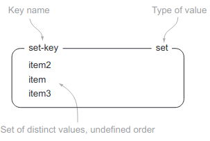

# NoSQL Databases

The growth of web applications has fueled a rapid increase in the volume and type of data that is generated, manipulated, analyzed, and archived. In addition, varied newer sets of sources,
including sensors, Global Positioning Systems (GPS), automated trackers and monitoring systems,
are generating a lot of data.

In parallel to the fast data growth, data is also becoming increasingly semi-structured. This means the traditional data management techniques around stricted schema definition and
relational references is also being questioned.

The quest to solve the problems related to large-volume and semi-structured data has led to the
emergence of a class of newer types of database products. This new class of database products
consists of column-oriented data stores, key/value pair databases, and document databases.
Collectively, these are identified as NoSQL.


## Common NoSQL databases


## Time-series Database (InfluxDB)

Time-series (סדרה עתית) is a sequence of data points, consisting of successive measurements made over a time interval.

Time-series databases are used in statistics, finance, IoT etc...

Example of time-series data is a stock price chart:


InfluxDB is an open source DB designed to handle time-series data.

## Key-value Store (Redis)


- Redis is an in-memory remote database (all data is stored in RAM)
- Offers high performance - can store hundreds of gigabytes of data and millions of requests per second
- Data is stored as key-value


### Redis data types

- Strings
- Lists
- Sets
- Sorted/Scored Sets
- Hashes

All accessed by a string “key”

### Data examples

| Key                   | Value                                           | Type       |
|-----------------------|-------------------------------------------------|------------|
| page:index.html       | \<html\>\<head\>[...]                               | String     |
| login_count           | 7464                                            | String     |
| users_logged_in_today | {1,2,3,4,5}                                     | Set        |
| latest_post_ids       | [201, 204, 209,..]                              | List       |
| user:123:session      | time=>10927353;  username=>joe                    | Hash       |
| users_and_scores      | joe\~1.3483; bert\~93.4; fred\~283.22; chris\~23774.17 | Sorted Set |

#### Strings

which shows a
STRING with key hello and value world.


```
$ redis-cli
redis 127.0.0.1:6379> set hello world
OK
redis 127.0.0.1:6379> get hello
"world"
redis 127.0.0.1:6379> del hello
(integer) 1
redis 127.0.0.1:6379> get hello
(nil)
redis 127.0.0.1:6379> exists hello
(integer) 0
```

More strings functions

**INCR** - Increments the number stored at key by one  
**INCRBY** - Increments the number stored at key by value  
**SETNX** - Set key to hold string value if key does not exist  
**SETEX** - Set key to hold the string value and set key to timeout after a given number of seconds

[MUCH more...](https://redis.io/commands/?group=string)

### Key expiration

When caching, you don’t want things to
live forever. Any item in Redis can be made to expire
after or at a certain time

```
$ redis-cli
redis 127.0.0.1:6379> set hello world
OK
redis 127.0.0.1:6379> EXPIRE hello 60
(integer) 1
redis 127.0.0.1:6379> TTL hello
(integer) 41
```

### Lists

LISTs in Redis store an ordered
sequence of strings


```
redis 127.0.0.1:6379> rpush list-key item
(integer) 1
redis 127.0.0.1:6379> rpush list-key item2
(integer) 2
redis 127.0.0.1:6379> rpush list-key item
(integer) 3
redis 127.0.0.1:6379> lrange list-key 0 -1
1) "item"
2) "item2"
3) "item"
redis 127.0.0.1:6379> lindex list-key 1
"item2"
redis 127.0.0.1:6379> lpop list-key
"item"
redis 127.0.0.1:6379> lrange list-key 0 -1
1) "item2"
2) "item"
redis 127.0.0.1:6379>
```

### Sets

In Redis, SETs are similar to LISTs in that
they’re a sequence of strings, but unlike
LISTs, Redis SETs use a hash table to keep
all strings unique



```
redis 127.0.0.1:6379> sadd set-key item
(integer) 1
redis 127.0.0.1:6379> sadd set-key item2
(integer) 1
redis 127.0.0.1:6379> sadd set-key item3
(integer) 1
redis 127.0.0.1:6379> sadd set-key item
(integer) 0
redis 127.0.0.1:6379> smembers set-key
1) "item"
2) "item2"
3) "item3"
redis 127.0.0.1:6379> sismember set-key item4
(integer) 0
redis 127.0.0.1:6379> sismember set-key item
(integer) 1
redis 127.0.0.1:6379> srem set-key item2
(integer) 1
redis 127.0.0.1:6379> srem set-key item2
(integer) 0
redis 127.0.0.1:6379> smembers set-key
1) "item"
2) "item3"
redis 127.0.0.1:6379>
```

### Redis commands in bash script

Just use echo with redis-cli like this:

`echo set hello world | redis-cli`

### Performance

Because memory access is faster than disk access (0.1 μs vs. 10 ms), Redis performs extremely well when compared to disk-‐centric databases.

Common range from 5000 to
120,000 rps for basic ops
GET/SET/LPUSH/LPOP, etc...

For more information explore the [`redis-benchmark` ](https://redis.io/docs/reference/optimization/benchmarks/)

### In-memory? What happens when my server is getting off?

Redis has two different forms of persistence available for writing in-memory data to disk in a compact format.

The first
method is a point-in-time dump either when certain conditions are met (a number of writes in a given period) or when one of the two dump-to-disk commands is called.

The other method uses an append-only file that writes every command that alters data
in Redis to disk as it happens. 

### Atomicity

Redis operations are atomic. It is not possible that a request issued by another client is served in the middle of the execution of another operation.

Redis server core is single threaded, so, for example, nothing will run until a given SET command has completed. That makes

```
# or SETNX {key} {value} EX {expiry}

SET {key} {value} EX {expiry} NX
```

ideal for simple locking implementation.

### High availability

Redis supports master/slave
replication where slaves connect to the master and receive an initial copy of the full
database. As writes are performed on the master, they’re sent to all connected slaves
for updating the slave datasets in real time.

### Language Support
Ruby, Python, PHP, Erlang,
Tcl, Perl, Lua, Java, Scala,
Clojure, C#, C/C++,
JavaScript/Node.js, Haskell,
IO, Go

## Document store (MongoDB)

A record in MongoDB is a document, which is a data structure composed of field and value pairs. MongoDB documents are similar to JSON objects. The values of fields may include other documents, arrays, and arrays of documents.


MongoDB stores documents in [collections](https://www.mongodb.com/docs/manual/core/databases-and-collections/#std-label-collections). Collections are analogous to tables in relational databases.

### Query API

The MongoDB Query API supports read and write operations (CRUD), as well as data Aggregation, and text Search.


### High Availability

MongoDB's replication facility, called replica set.
A replica set is a group of MongoDB servers that maintain the same data set, providing redundancy and increasing data availability. 


### Horizontal Scalability

MongoDB provides horizontal scalability as part of its core functionality. Sharding distributes data across a cluster of machines.


### Install on Ubuntu
https://www.mongodb.com/docs/manual/tutorial/install-mongodb-on-ubuntu/

### Run in Docker container

You can skip the installation and run pre-built mongo server within a Docker container by

```
docker run --rm --name mongo-1 -it mongo:5
```

Then get an access to the `mongo` shell within the running container by
```
docker exec -it some-mongo mongo
```

### The mongo shell
The mongo shell is an interactive JavaScript interface to MongoDB. You can use the mongo shell to query and update data as well as perform administrative operations.


Let's complete the [getting started](https://www.mongodb.com/docs/manual/tutorial/getting-started/) tutorial. 


### Using Docker to Deploy a MongoDB Cluster/Replica Set

[reference](https://www.mongodb.com/compatibility/deploying-a-mongodb-cluster-with-docker)

A replica set is a group of MongoDB servers, called nodes, containing an identical copy of the data. If one of the servers fails, the other two will pick up the load while the crashed one restarts.

The first step is to create a Docker network. This network will let each of your containers running in this network see each other. To create a network, run the `docker network create` command.

```
docker network create mongonet
```

To start the first container in the cluster, use the docker run command:
```
docker run --rm --name mongo1 -p 27017:27017 --network mongonet mongo:5 mongod --replSet myReplicaSet --bind_ip localhost,mongo1
```

Let's add two more containers to the cluster
```
docker run --rm --name mongo2 -p 27018:27017 --network mongonet mongo:5 mongod --replSet myReplicaSet --bind_ip localhost,mongo2
 
docker run --rm --name mongo3 -p 27019:27017 --network mongonet mongo:5 mongod --replSet myReplicaSet --bind_ip localhost,mongo3

```

You now have three containers running MongoDB. You can use `docker ps` to validate that they are running.

#### Initiate the Replica Set


The next step is to create the actual replica set with the three members. To do so, you will need to use the MongoDB Shell. This CLI (command-line interface) tool is available with the default MongoDB installation or installed independently. However, if you don’t have the tool installed on your laptop, it is possible to use `mongosh` available inside containers with the `docker exec` command.

```
docker exec -it mongo1 mongo
```

Now initiate the replica set using the `rs.initiate()` command.

As part of the configuration object that is passed to rs.initiate(), you will need to specify the name of the replica set (myReplicaSet, in this case), along with the list of members that will be part of the replica set.

```
rs.initiate({_id: "myReplicaSet", members: [{_id: 0, host: "mongo1"}, {_id: 1, host: "mongo2"}, {_id: 2, host: "mongo3"}]})
```

You can verify that the replica set has been configured successfilly by
```
rs.status()
```


### Testing replication and high availability

How?


