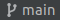
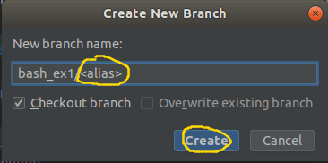

# Default profile for new Linux Users

In this exercise, you will implement a bash script which applies default Bash profile configurations for new added Linux users.

## Preliminaries 

- Open [our shared git repo](https://github.com/alonitac/DevSecOpsBIU12.git) in PyCharm (or clone if you didn't do it yet: git -> clone...) and pull the repository  to get an up-to-date version of the repository. 
- From PyCharm button right bar, click the  button to display Git branches in the repo. Choose **+ New branch** to create your own git branch by(Git branches will be discussed later).
- In the opened window, give your branch a name according to the following template:

```text
bash_ex1/<alias>
```

While changing `<alias>` to your nickname. e.g. `bash_ex1/alonit`. The branch name must start with `bash_ex1/`.



- Finally, review the content of [Bash profile configuration files](../bash/07_bash-conf-files.md).

Great. Let's get started... 


## Background 

In many Linux systems, the `/etc/skel` directory provides a way to assure new users are added to your Linux system has default 
Bash profile configurations.
When adding a new user with **adduser**, it will create the user's home directory and copy files from `/etc/skel` to the new user's home directory.

## Guidelines

**Note:** should be done in Ubuntu systems.

1. In `/etc/skel` edit `.bash_profile` file using your favorite text editor (`nano`, `vi` etc...) as detailed below. If this file already exists, append your code at the end (it's highly recommended to backup the original file before). 
   1. Greet the user. e.g. if the user is **john**, the message `Hello john` will be printed to stdout (standard output). 
   2. Print how many packages are outdated (`/usr/lib/update-notifier/apt-check --human-readable`).
   3. Given a file called `.token` in the home directory of the user, check the file permissions. If the octal representation of the permissions set is different from 600 (read and write by the user **only**), print a warning message to the user:  
      **Warning: .token file has too wide permissions**   
      Use `stat -c "%a"` to get permissions set of the file in an octal form. Use [_if statements_](https://tldp.org/LDP/Bash-Beginners-Guide/html/sect_07_01.html) to test if the file exists, and that the permissions are not equal to "600". 
   4. Add an environment variable called `COURSE_ID` with a value equals to `devsecops12`.
   5. (Optional) Define [zsh](https://github.com/ohmyzsh/ohmyzsh/wiki) as the default shell for the user (`zsh` should be installed in your system first).
2. Create a new Linux user using `adduser` command. If everything done well, the new user should have the custom script profile you created. 
3. Login to the new user terminal session: `su -l <username>`. Replace `<username>` to the created user.
   The output should be similar to:

```text
alon@localhost:~$ su -l newuser
Password: 
Hello newuser

20 updates can be applied immediately.
To see these additional updates run: apt list --upgradable

Warning: .token file has too open permissions
newuser@localhost:~$
```

## Submission 

Copy your code solution into `ex1/customUserProfile.sh`. For example,
if your `/etc/skel/.bash_profile` file looks like:

```shell
# some code ...

echo bla bla bla

# some code...

echo bla bla bla

```

You should copy the following code into `ex1/customUserProfile.sh`:
```shell
# some code ...

echo bla bla bla

# some code...

echo bla bla bla

```

Finally, _commit_  your solution. The **only** file that has to be committed is `ex1/customUserProfile.sh`. 
After clicking on commit button, write some info message regarding your commit in the **Commit Message** and click the **Commit** button.
The message is a free text written by the developer, providing some information regarding the changes you are committing, that could be something like "initial solution" or "bash ex1 solution - work in progress" or "bash ex1 - final solution!". Feel free to fix your code and commit the changes again and again. You can commit as much as you want.  

Then _push_  your solution to GitHub. Bravo! you've submitted your solution! Your solution has to pass an automated tests.
Go to [GitHub actions](https://github.com/alonitac/DevSecOpsBIU12/actions) and make sure your solution has passed the tests. You must see the following message:  
```text
WELL DONE!!! you've passed all tests!
```
Otherwise, your solution has to be fixed. Do your changes, commit and push again.

## Good luck
Feel free to ask any questions! 
