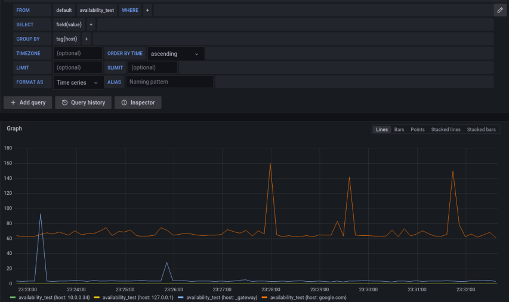

# Servers Availability Test Agent

In this exercise, you will implement a bash script which continuously 
monitor the availability of a pre-determined set of servers using the `ping` command. 
It sends the test results to an InfluxDB database and display results in Grafana dashboard. 

## Preliminaries

- Open [our shared git repo](https://github.com/alonitac/DevSecOpsBIU12.git) in PyCharm (or clone if you didn't do it yet: git -> clone...)
- Make sure you are on Git branch `main`! If the bottom right bar in your PyCharm looks different from  , click on it, hover the `main` branch and click **Checkout**.
- On branch `main`, pull the repository  to get an up-to-date version of the repository.
- From PyCharm button right bar, click the  button to display Git branches in the repo. Choose **+ New branch** to create your own git branch by(Git branches will be discussed later).
- In the opened window, give your branch a name according to the following template:

```text
bash_ex2/<alias>
```

While changing `<alias>` to your nickname. e.g. `bash_ex2/alonit`. The branch name must start with `bash_ex1/`.

- [Install Docker on your Ubuntu](https://docs.docker.com/engine/install/ubuntu/) if needed.

## Guidelines

You will write your availability agent script in `ex2/availabilityAgent.sh`.
In this file you are given a code template of an empty [`while` loop](https://tldp.org/LDP/Bash-Beginners-Guide/html/sect_09_02.html) which is iterating **forever**. The loop body will be executed every `TEST_PERIODICITY` seconds (5 seconds in our case).

Your goal is to implement the loop body:

1. Within the given while loop, write **another** _for_ or _while_ loop, to iterate over the lines of file `hosts`. [Search how to do it](https://www.google.com/search?&q=iterate+over+lines+in+file+bash). 
   (take a look on this file in the repo). Each line in the file is an ip address or domain name which its availability will be tested by your agent (note that `hosts` file must have an empty new line at the end). 
2. For each ip or host name, use the `ping` command to send a **single** ping (a.k.a. ECHO_REQUEST) to the host, with a timeout of 2 seconds. You can do it by `ping -c 1 -W 2` (read the [ping man](https://linux.die.net/man/8/ping) to understand each option).
3. Write the result of the ping command to stdout, as follows: `Test result for <HOST or IP> is <0 or 1> at <TIME in nanoseconds>` where `<HOST or IP>` is the host name, `<1 or 0>` indicating test result (1 for ping received,  0 for failure), and `<TIME in nanoseconds>` is the [epoch](https://www.epochconverter.com/) timestamp in nanoseconds (e.g. 1656185552414281166). Here is an example of possible output after 3 iterations (3 tests):  
   ```text
    Test result for _gateway is 1 at 1656185707197665570
    Test result for 127.0.0.1 is 1 at 1656185707201188474
    Test result for google.com is 1 at 1656185707332373248
    Test result for 10.0.0.34 is 0 at 1656185709337459261
    
    Test result for _gateway is 1 at 1656185714355446952
    Test result for 127.0.0.1 is 1 at 1656185714359241137
    Test result for google.com is 1 at 1656185714495568586
    Test result for 10.0.0.34 is 0 at 1656185716502795348
    
    Test result for _gateway is 1 at 1656185721523610633
    Test result for 127.0.0.1 is 1 at 1656185721527209506
    Test result for google.com is 1 at 1656185721681408567
    Test result for 10.0.0.34 is 0 at 1656185723686750747

   ```
   
4. Now, we would like to write test results to a database called [InfluxDB, version 1.8](https://docs.influxdata.com/influxdb/v1.8/guides/write_data/). You will run the database in a Docker container.
   1. In a separate terminal session, run the InfluxDB container by `docker run --rm --name influxdb -p 8086:8086 -e INFLUXDB_ADMIN_USER=admin -e INFLUXDB_ADMIN_PASSWORD=12345678 -e INFLUXDB_HTTP_AUTH_ENABLED=true influxdb:1.8.10`. Make sure port `8086` isn't bound to any other process. Don't worry if you don't understand every piece of this command, Docker containers will be discussed later on in the course.   
      If your container is running well, you'll see an info message `Listening for signals` in the container's log in your terminal. Look for it.
   2. In order to write data to InfluxDB, we need to create a database first. In another new terminal session, create a database named `hosts_metrics` in which the test data will be stored. To do so, perform the following POST HTTP request:
      ```shell
      curl -X POST 'http://localhost:8086/query' -u admin:12345678 --data-urlencode "q=CREATE DATABASE hosts_metrics"
      ```
      Upon successful creation, you'll get the following output: `{"results":[{"statement_id":0}]}`. Try to understand this command. 
   3. You have an InfluxDB instance running with an empty database, let's get back to your bash script. In the same place where you print the test results (step 3), use the following command to write the test results to InfluxDB:
      ```shell
      curl -X POST 'http://localhost:8086/write?db=hosts_metrics' -u $DB_USERNAME:$DB_PASSWORD  --data-binary "availability_test,host=$TESTED_HOST value=$RESULT $TEST_TIMESTAMP"
      ```
      As you can see, this is another `curl` command. Make sure you understand every part of the command.  
      Notice the `TESTED_HOST` variable which represents the tested host, `RESULT` variable which represents the test result (as described above) and `TEST_TIMESTAMP` 
      which represents the time the host was (approximately) tested. **You must create those variables yourself** so the test data will be written to Influx correctly.
      Also, note the `DB_USERNAME` and `DB_PASSWORD` variables which represent the admin username and password for connecting the db (`admin` and `12345678` accordingly). **You should create those variables as an environment variables**, i.e. `export` them before you run the script. The script assumes those variables are already defined. 

5. Display test results in Grafana, as follows:

   1. Run Grafana server in a Docker container by
      ```shell
      docker run --rm --name grafana -e "GF_SERVER_HTTP_PORT=3003" --network host grafana/grafana-oss
      ```
   2. After initialization, visit you server in [http://localhost:3003](http://localhost:3003).
   3. Default username and password is `admin`.
   4. Now we want to integrate InfluxDB as a data source in Grafana. On the left menu, under **Configuration** button, click **Data sources**.
   5. In the opened configuration console, choose **Add data source**, then choose **InfluxDB**.
   6. In the data source setting page, under **HTTP** section **URL** field, enter influxDB url: `http://localhost:8086`.
   7. In **Auth** section, turn on the **Basic auth** toggle, and enter the InflucDB username (`admin`) and password (`12345678`) in the appropriate fields below. 
   8. In **InfluxDB Details** section, under **Database** enter your db name: `hosts_metrics`.
   9. Finally, click **Save & Test**, and make sure you get the _Data source is working_ message.
   10. Click **Explore**
   11. In the exploration panel, build a graph of the test results over time. Your graph should look similar to the bellow screenshot.   
       

6. (Optional) Instead to write 0 or 1 as test results, it's better to write the ping **latency**. For example, the following ping took 127 milliseconds: 
   ```text
   64 bytes from mrs08s19-in-f14.1e100.net (142.250.201.14): icmp_seq=1 ttl=115 time=127 ms
   ```
   Use text manipulation command and write the ping latency as test result. If ping failed, write 0 as test result. **Hint**: `grep -oP '(?<=time=)\d+(\.\d+)?'`

## Submission

_commit_  your solution. The **only** file that has to be committed is `ex2/availabilityAgent.sh`.
After clicking on the commit button, write some info message regarding your commit in the **Commit Message** and click the **Commit** button.
The message is a free text written by the developer, providing some information regarding the changes you are committing, that could be something like "initial solution" or "bash ex2 solution - work in progress (wip)" or "bash ex2 - final solution!". Feel free to fix your code and commit the changes again and again. You can commit as much as you want.

Then _push_  your solution to GitHub. Bravo! you've submitted your solution! Your solution has to pass an automated tests.
Go to [GitHub actions](https://github.com/alonitac/DevSecOpsBIU12/actions) and make sure your solution has passed the tests. You must see the following message:
```text
WELL DONE!!! you've passed all tests!
```
Otherwise, your solution has to be fixed. Do your changes, commit and push again.

## Good luck

Feel free to ask any questions!
