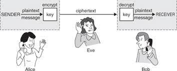

# Ex4 - Implement TLS handshake
 
## Preliminaries

Create your own git branch for this exercise according to  `bash_ex4/<alias>` (replace `<alias>` by your name, e.g. `bash_ex4/alonit`).

### TLS communication



As you know, the communication in HTTP protocol is insecure, and since Eve is listening on the channel between you (Alice) and the web server (Bob), you are required to create a secure channel. 
This is exactly what SSL/TLS does. The process of establishing a secure SSL/TLS connection involves several steps. SSL/TLS security protocols use a combination of _asymmetric_ and _symmetric_ encryption:

##### Step 1 - Client Hello (Client -> Server). 

First, the client sends a _Client Hello_ to the server.

##### Step 2 - Server Hello (Server -> Client)

The server replies with a _Server Hello_. A Server Hello includes the following information:

- **Server Version** - the TLS version the server uses
- **Session ID** - it is used to resume the current communication session between the server and the client
- **Server digital certificate** - the certificate contains some details about the server, as well as a public key with which the client can encrypt messages to the server. The certificate itself is signed by Certificate Authority (CA).


##### Step 3 - Server Certificate Verification 

As seen above, Eve is "sitting" on the channel between Alice and Bob. So what's stopping her from impersonating Bob, and once Alice sends _Client Hello_, she is replied by a fake _Server Hello_ message with "certificate" issued by Eve itself. In such case, Alice would believe that the certificate belongs to Bob, encrypt messages to Bob using the certificate, without knowing that Eve could decrypt the messages.

Here the CA comes into the picture. CA is an entity (e.g. Amazon Web Services, Microsoft etc...) trusted by both sides (client and server) that issues and signs digital certificates, so the ownership of a public key can be easily verified.

In this step the client verifies the server's digital certificate.


##### Step 4 - Client-Server master-key exchange

Cert was verified successfully? great we can move on...

Now, the client and the server should agree on a _symmetric key_ (called _master key_) with which they will communicate during the session. 
The client generates a 32-bytes random master-key, encrypts it using the server's certificate and sends the encrypted message in the channel. 

In addition to the encrypted master-key, the client sends a sample message to verify that the symmetric key encryption works.    

##### Step 5 - Server verification message 

The server decrypts the encrypted master-key. From now on, every message between both sides will be symmetrically encrypted by the master-key. 
The server encrypts the sample message and sends it to the client. 

##### Step 6 - Client verification message

The Client verifies that the sample message was encrypted successfully.


#### Let's get started...

You need to run the HTTP server that you are going to communicate with. The server written in Python.

First, install python requirements by:

```shell
pip install aiohttp
```

Then, run the server by (python is required in your system):

```shell
cd ex4_optional/tls_webserver
python app.py
```

The server url is `http://localhost:8080`. 
Your goal is to perform the above steps using BASH commands, and establish a secure channel with the server. 

Please work in Ubuntu terminal, not from PyCharm. Below are some helpful instructions you may utilize in each step. Eventually, all your code should be written in `ex4_optional/tlsHandshake.sh`, committed and pushed to GitHub. 

Use `curl` to send the following _Client Hello_ HTTP request to the server:
```
POST /clienthello
{
  "clientVersion": "3.2",
  "message": "Client Hello"
}
```
_POST_ is the request type, _/clienthello_ is the endpoint, and the json is the body.  

_Server Hello_ response will be in the form:
```json
{
  "serverVersion": "3.2",
  "sessionID": "......",
  "serverCert": "......"
}
```
The response is in json format. You may want to keep the sessionID in a variable called `SESSION_ID` for later usage,
and save the server cert in a file called `cert.pem`.
Use the command `jq -r '.<key>'` to parse and save specific keys from the JSON response (replace `<key>` by _serverVersion_, _sessionID_ or _serverCert_ according to your needs). You should use pipe (`|`) in order to pass the HTTP json response as an input to `jq`. Don't have `jq` on your Ubuntu? you know how to install it...

Assuming the server certificate was stored in `cert.pem` file. You can verify the certificate by:
```shell
openssl verify -CAfile cert-ca-aws.pem cert.pem
```
while `cert-ca-aws.pem` is a file belonging to the Certificate Authority (in our case Amazon Web Services) who issued and signed the server cert. You can safely download it from **https://devops-may22.s3.eu-north-1.amazonaws.com/cert-ca-aws.pem** (wget...)

Upon a valid certificate validation, the following output will be printed to stdout:
```text
cert.pem: OK
```

In your tlsHandshake.sh file, use this snippet to exit the program if the certificate validation failed. Make sure you understand the code.
```shell
VERIFICATION_RESULT=$( openssl verify -CAfile cert-ca-aws.pem cert.pem )

if [ "$VERIFICATION_RESULT" != "cert.pem: OK" ]; then
  echo "Server Certificate is invalid."
  exit 1
fi
```

Given a valid cert, generate a 32 random bytes base64 string (use `openssl rand`) and save it to `masterKey.txt` text file.

Got tired? refresh yourself with some [interesting reading](https://www.bleepingcomputer.com/news/security/russia-creates-its-own-tls-certificate-authority-to-bypass-sanctions/amp/).  

This line can help you encrypt the generated master-key secret with the server certificate:
```shell
openssl smime -encrypt -aes-256-cbc -in masterKey.txt -outform DER cert.pem | base64 -w 0
```

Now, `curl` again an HTTP POST request to the server endpoint `/keyexchange`, with the following body
```
POST /keyexchange
{
    "sessionID": "'$SESSION_ID'",
    "masterKey": "'$MASTER_KEY'",
    "sampleMessage": "Hi server, please encrypt me and send to client!"
}
```

Note that `$SESSION_ID` is a BASH variable containing the session ID you've got from the server's hello response, you need to create this variable once you have the sessions ID from the server. Also, `$MASTER_KEY` is your **encrypted** master key, again, you need to create this variable.

The response for the above request would be in the form:
```json
{
  "sessionID": ".....",
  "encryptedSampleMessage": "....."
}
```
All you have to do now is to decrypt the sample message and verify that it's equal to the original sample message. 
This will indicate that the server uses successfully the master key.
Please note that the _encryptedSampleMessage_ is encoded in base64, before you decrypt it, encode it to binary, as following:
```shell
# the content of encryptedSampleMessage is stored in a file called encSampleMsg.txt

cat encSampleMsg.txt | base64 -d > encSampleMsgReady.txt

# file encSampleMsgReady.txt is ready now to be used in "openssl enc...." command 
```

Take a look on the code 
Recall the demo in `encryption` directory in our shared repo to see how to decrypt a message. Again, you should exit the program upon an invalid decryption. Do it by:
```shell
if [ "$DECRYPTED_SAMPLE_MESSAGE" != "Hi server, please encrypt me and send to client!" ]; then
  echo "Server symmetric encryption using the exchanged master-key has failed."
  exit 1
else
  echo "Client-Server TLS handshake has been completed successfully"
fi
```

**Well Done! you've manually implemented a secure communication over HTTP :-)**

In real life we have TLS that does so for us, and it's quite similar to what you've done.


# Good Luck

Don't hesitate to ask any questions